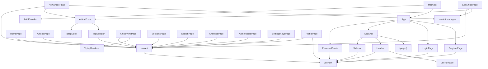

# Frontend Structure

> **⚠️ Bu dosya `AGENTS.md`'ye tabidir.** Çelişki durumunda `AGENTS.md` geçerlidir.
> File Locations, Conventions → `AGENTS.md`

## Directory Layout

```
frontend/src/
├── main.tsx                  # Entry point: MsalProvider + AuthProvider + App
├── App.tsx                   # BrowserRouter + route definitions + ProtectedRoute
├── index.css                 # Tailwind v4 import + CSS custom properties + dark mode
├── config/
│   └── msalConfig.ts          # MSAL.js configuration (Azure AD clientId, tenantId, scopes)
├── contexts/
│   ├── AuthContext.tsx        # JWT auth state, login/logout/register/loginWithAzure, auto-revalidation
│   └── ThemeContext.tsx       # Light/Dark/System theme toggle, persisted to localStorage
├── hooks/
│   ├── useApi.ts              # fetchWithAuth — JWT injection, auto-logout on 401
│   └── useArticleImages.ts    # Shared deferred image/file upload logic (blob URL → real URL)
├── lib/
│   └── utils.ts               # cn() — clsx + tailwind-merge helper
├── components/
│   ├── error-boundary.tsx     # React error boundary with reload button
│   ├── toast-provider.tsx     # Sonner Toaster wrapper component
│   ├── layout/
│   │   ├── app-shell.tsx      # Sidebar + Header + Outlet wrapper (skipped on auth pages)
│   │   ├── sidebar.tsx        # Left nav with role-based admin section
│   │   └── header.tsx         # Top bar: search, notifications, profile, logout
│   └── editor/
│       ├── article-form.tsx   # Shared article form (title, metadata, editor, attachments slot)
│       ├── tiptap-editor.tsx  # Rich-text editor (TipTap) with formatting toolbar + image upload
│       ├── tiptap-renderer.tsx # TipTap JSON → React element renderer
│       └── tag-selector.tsx   # Tag picker with inline tag creation
├── attachments/
│   ├── attachment-list.tsx    # File list with deferred upload/delete, download UI
│   └── file-upload-zone.tsx   # PendingFileList component for new articles (no articleId yet)
└── pages/
    ├── LoginPage.tsx          # Email/password form → POST /api/auth/login
    ├── RegisterPage.tsx       # Registration form → POST /api/auth/register
    ├── HomePage.tsx           # Dashboard stats + recent articles + top searches
    ├── ArticlesPage.tsx       # Article list with status badges
    ├── NewArticlePage.tsx     # Create article form with TipTap editor
    ├── EditArticlePage.tsx    # Edit article form with versioning + change summary
    ├── ArticleViewPage.tsx    # Article reader with TipTap renderer + feedback
    ├── VersionsPage.tsx       # Version history + line-based diff comparison
    ├── SearchPage.tsx         # Multi-mode search (fulltext/semantic/hybrid/RAG) + tag autocomplete
    ├── AnalyticsPage.tsx      # Analytics dashboard: stats, top searches, content gaps
    ├── AdminUsersPage.tsx     # User CRUD with pagination, search, role badges
    ├── SettingsKeysPage.tsx   # API key management: create, copy, delete
    ├── TagsPage.tsx           # Tag management: list, edit, delete (admin/editor only)
    ├── ProfilePage.tsx        # Profile settings: name/email update + password change
    └── NotFoundPage.tsx       # 404 page for unmatched routes
```

## Component Dependency Graph



## Routing

### Route Table

| Path | Component | Auth | Layout | Role Restriction |
|------|-----------|------|--------|-----------------|
| `/login` | LoginPage | Public | AppShell (renders Outlet only, no Sidebar/Header) | — |
| `/register` | RegisterPage | Public | AppShell (renders Outlet only, no Sidebar/Header) | — |
| `/` | HomePage | Protected | AppShell (Sidebar + Header) | — |
| `/articles` | ArticlesPage | Protected | AppShell | — |
| `/articles/new` | NewArticlePage | Protected | AppShell | — |
| `/articles/:slug` | ArticleViewPage | Protected | AppShell | — |
| `/articles/:slug/edit` | EditArticlePage | Protected | AppShell | — |
| `/articles/:slug/versions` | VersionsPage | Protected | AppShell | — |
| `/search` | SearchPage | Protected | AppShell | — |
| `/profile` | ProfilePage | Protected | AppShell | — |
| `/analytics` | AnalyticsPage | Protected | AppShell | admin, editor (RoleRoute) |
| `/admin/users` | AdminUsersPage | Protected | AppShell | admin (RoleRoute) |
| `/settings/keys` | SettingsKeysPage | Protected | AppShell | admin (RoleRoute) |
| `*` | NotFoundPage | Public | — | — |

### ProtectedRoute

```typescript
function ProtectedRoute({ children }: { children: React.ReactNode }) {
  const { user, loading } = useAuth();
  if (loading) return <div>Loading...</div>;
  if (!user) return <Navigate to="/login" replace />;
  return <>{children}</>;
}
```

Shows loading state while auth is being validated. Redirects to `/login` if no user.

### Navigation

Sidebar navigation is **role-aware**:
- All users see: Home, Articles (with "New Article" nested), Search, Analytics
- Admin/editor users additionally see: **Admin** section with Users (admin only) and API Keys

## Global State

### AuthContext

| Field | Type | Description |
|-------|------|-------------|
| `user` | `User \| null` | Current authenticated user |
| `token` | `string \| null` | JWT token string |
| `loading` | `boolean` | True during initial auth check on mount |
| `login()` | `(email, password) → Promise<{error?}>` | Authenticates and sets user + token |
| `logout()` | `() → void` | Clears state and localStorage |
| `register()` | `(name, email, password) → Promise<{error?}>` | Creates account |
| `refreshUser()` | `() → Promise<void>` | Re-fetches /api/auth/me, updates user state |

**Token lifecycle**:
1. `login()` calls `POST /api/auth/login`, stores token in `localStorage`
2. On page load, reads token from `localStorage`, validates via `GET /api/auth/me`
3. On 401 from any API call, `useApi` hook triggers `logout()` (clears everything)
4. Token TTL: 24 hours (server-side JWT expiration)

## API Communication Pattern

All authenticated API calls follow this pattern:

```typescript
const { fetchWithAuth } = useApi();

// Inside a useEffect or event handler:
const res = await fetchWithAuth('/api/articles', {
  method: 'POST',
  body: JSON.stringify({ title: 'My Article' })
});

if (res.ok) {
  const data = await res.json();
  // handle success
} else {
  const err = await res.json();
  setError(err.error);
}
```

The hook:
- Auto-injects `Authorization: Bearer {token}`
- Auto-sets `Content-Type: application/json` for string bodies
- Triggers `logout()` on 401 (redirects to login)
- Returns raw `Response` for manual parsing

## Editor Components

### TiptapEditor

Rich-text editing component used on NewArticlePage and EditArticlePage.

**Props**: `{ content: Record<string, unknown> | null, onChange: (json) => void }`

**Toolbar actions**: Bold, Italic, Strikethrough, Code, Highlight, H1, H2, H3, Bullet List, Ordered List, Task List, Quote, Horizontal Rule, Code Block, Undo, Redo

**Output**: TipTap JSON document emitted on every change via `onUpdate`.

### TiptapRenderer

Read-only renderer that converts TipTap JSON to React elements. Used on ArticleViewPage.

**Supported nodes**: paragraph, heading (1–3), bulletList, orderedList, listItem, taskList, taskItem, blockquote, codeBlock, horizontalRule, hardBreak, image, table/tableRow/tableCell/tableHeader

**Supported marks**: bold, italic, strikethrough, code, link (`target="_blank"`, `rel="noopener noreferrer"`), highlight

### TagSelector

Tag picker with inline creation capability.

**Props**: `{ selectedTags: string[], onChange: (tagIds: string[]) => void }`

**Behavior**:
- Loads all tags from `GET /api/tags` on mount
- Displays selected tags as removable chips
- Dropdown for adding available tags
- Inline "New tag" creation via `POST /api/tags`

## Styling Conventions

- **Framework**: Tailwind CSS v4 (utility-first)
- **Class merging**: `cn()` helper (clsx + tailwind-merge)
- **Dark mode**: System preference via `prefers-color-scheme: dark`; CSS custom properties for background/foreground
- **Fonts**: Geist (sans-serif), Geist Mono (monospace) via `@theme inline`
- **Icons**: `lucide-react` exclusively (no other icon libraries)
- **Color patterns**:
  - Status badges: draft=zinc, pending=amber, published=green, archived=red
  - Status badges: draft=gray, pending=amber, published=green, archived=red
  - Role badges: admin=red, editor=blue, viewer=gray
  - Dashboard stat cards: blue, green, amber, purple

## Page-by-Page API Dependency Map

| Page | API Endpoints Used |
|------|-------------------|
| LoginPage | `POST /api/auth/login` |
| RegisterPage | `POST /api/auth/register` |
| HomePage | `GET /api/dashboard` |
| ArticlesPage | `GET /api/articles` |
| NewArticlePage | `POST /api/articles`, `GET /api/tags`, `POST /api/tags` |
| EditArticlePage | `GET /api/articles/:slug`, `PUT /api/articles/:id`, `GET /api/tags`, `POST /api/tags` |
| ArticleViewPage | `GET /api/articles/:slug`, `POST /api/articles/:id/vote`, `GET /api/articles/:id/votes`, `GET /api/articles/:id/comments`, `POST /api/articles/:id/comments` |
| VersionsPage | `GET /api/articles/:slug`, `GET /api/articles/:id/versions`, `GET /api/articles/:id/versions/:vid` |
| SearchPage | `GET /api/search`, `GET /api/tags` |
| AnalyticsPage | `GET /api/analytics` |
| AdminUsersPage | `GET/POST/PUT/DELETE /api/admin/users` |
| SettingsKeysPage | `GET/POST/DELETE /api/keys` |
