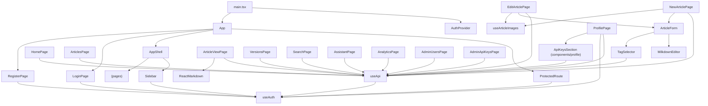

# Frontend Structure

> **⚠️ Bu dosya `AGENTS.md`'ye tabidir.** Çelişki durumunda `AGENTS.md` geçerlidir.
> File Locations, Conventions → `AGENTS.md`

## Directory Layout

```
frontend/
├── auth-popup-callback.html   # Vite multi-page entry: Azure AD popup redirect target (no React)
└── src/
    ├── main.tsx                  # Entry point: MsalProvider + AuthProvider + App
    ├── auth-popup-callback.ts    # Popup callback: broadcastResponseToMainFrame (MSAL v5 redirect bridge)
    ├── App.tsx                   # BrowserRouter + route definitions + ProtectedRoute
    ├── index.css                 # Tailwind v4 import + CSS custom properties + dark mode
    ├── config/
    │   ├── features.ts            # Build-time feature switches (Assistant defaults on)
    │   └── msalConfig.ts          # MSAL.js configuration (Azure AD clientId, tenantId, scopes)
├── contexts/
│   ├── AuthContext.tsx        # JWT auth state, login/logout/register/loginWithAzure, auto-revalidation
│   └── ThemeContext.tsx       # Light/Dark/System theme toggle, persisted to localStorage
├── hooks/
│   ├── useApi.ts              # fetchWithAuth — JWT injection, auto-logout on 401
│   └── useArticleImages.ts    # Shared deferred image/file upload logic (blob URL → real URL)
├── lib/
│   ├── utils.ts               # cn() — clsx + tailwind-merge helper
│   └── lookup-utils.ts        # Dynamic color map (20 Tailwind colors) + icon resolver (all lucide-react icons)
├── components/
│   ├── error-boundary.tsx     # React error boundary with reload button
│   ├── toast-provider.tsx     # Sonner Toaster wrapper component
│   ├── ContentTypeBadge.tsx   # Colored badge with icon for content types (uses LookupValue color/icon)
│   ├── lookup-pickers.tsx     # ColorPicker (20-color grid popup) + IconPicker (searchable all lucide icons)
│   ├── layout/
│   │   ├── app-shell.tsx      # Sidebar + Outlet wrapper (sidebar skipped on auth pages)
│   │   ├── sidebar.tsx        # Left nav with role-based admin section
│   │   ├── mcp-modal.tsx      # MCP connection info modal (endpoint, token/key copy, config snippets)
│   └── editor/
│       ├── article-form.tsx   # Shared article form (title, metadata, editor, attachments slot)
│       ├── milkdown-editor.tsx # Milkdown Crepe editor; Markdown updates + deferred image upload
│       └── tag-selector.tsx   # Tag picker with inline tag creation
├── attachments/
│   ├── attachment-list.tsx    # File list with deferred upload/delete, download UI
│   └── file-upload-zone.tsx   # PendingFileList component for new articles (no articleId yet)
└── pages/
    ├── LoginPage.tsx          # Email/password form → POST /api/auth/login
    ├── RegisterPage.tsx       # Registration-disabled notice; API endpoint remains available
    ├── HomePage.tsx           # Dashboard stats + recent articles + top searches
    ├── ArticlesPage.tsx       # Article list with status badges
    ├── NewArticlePage.tsx     # Create article form with Milkdown editor
    ├── EditArticlePage.tsx    # Edit article form with versioning + change summary
    ├── ArticleViewPage.tsx    # Markdown article reader + feedback
    ├── VersionsPage.tsx       # Version history + line-based diff comparison
    ├── SearchPage.tsx         # Document discovery via fulltext/semantic/hybrid modes, metadata autocomplete and query handoff to Assistant
    ├── AssistantPage.tsx      # Canonical grounded-answer UI with one page-session conversation and per-answer source links
    ├── AnalyticsPage.tsx      # Analytics dashboard: stats, top searches, content gaps
    ├── AdminUsersPage.tsx     # User CRUD with pagination, search, role badges
    ├── AdminApiKeysPage.tsx   # All-user API key CRUD: list, search, add, edit, delete (admin only)
    ├── TagsPage.tsx           # Tag management: list, edit, delete (admin/editor only)
    ├── ProfilePage.tsx        # Profile settings, tabbed (?tab=): Personal Info | Password | API Keys (api-keys-section)
    ├── LookupsPage.tsx        # Content-type lookup management
    ├── LogsPage.tsx           # System log viewer: date-based log files, view/delete (admin only)
    ├── BulkTransferPage.tsx   # Bulk import/export and templates (admin/editor)
    ├── KnowledgeImportPage.tsx # Source-file analysis, Markdown preview and commit
    ├── FeaturedLinksPage.tsx  # Sidebar featured-link management (admin)
    ├── SearchDiagnosticsPage.tsx # Search/index diagnostics (admin)
    ├── RagEvaluationsPage.tsx # Golden datasets, runs and feedback summary (admin)
    └── NotFoundPage.tsx       # 404 page for unmatched routes
```

## Component Dependency Graph



## Routing

### Route Table

| Path | Component | Auth | Layout | Role Restriction |
|------|-----------|------|--------|-----------------|
| `/login` | LoginPage | Public | AppShell (renders Outlet only, no Sidebar) | — |
| `/register` | RegisterPage | Public | AppShell (renders Outlet only, no Sidebar) | — |
| `/` | HomePage | Protected | AppShell (Sidebar + Outlet) | — |
| `/articles` | ArticlesPage | Protected | AppShell | — |
| `/articles/new` | NewArticlePage | Protected | AppShell | — |
| `/articles/:slug` | ArticleViewPage | Protected | AppShell | — |
| `/articles/:slug/edit` | EditArticlePage | Protected | AppShell | — |
| `/articles/:slug/versions` | VersionsPage | Protected | AppShell | — |
| `/search` | SearchPage | Protected | AppShell | Document-result modes; a populated query can be handed to `/assistant?q=...&mode=answer` |
| `/assistant` | AssistantPage | Protected | AppShell | Canonical grounded-answer surface integrated directly into the standard page layout (no standalone framed shell); one conversation for the open page session, no previous-conversation browser, verified SSE, source links directly below every answer, citations, feedback and cache/calibration indicators |
| `/profile` | ProfilePage | Protected | AppShell | — |
| `/analytics` | AnalyticsPage | Protected | AppShell | admin, editor (RoleRoute) |
| `/tags` | TagsPage | Protected | AppShell | admin, editor (RoleRoute) |
| `/settings/bulk-transfer` | BulkTransferPage | Protected | AppShell | admin, editor (RoleRoute) |
| `/articles/import` | KnowledgeImportPage | Protected | AppShell | — |
| `/admin/users` | AdminUsersPage | Protected | AppShell | admin (RoleRoute) |
| `/admin/keys` | AdminApiKeysPage | Protected | AppShell | admin (RoleRoute) |
| `/settings/keys` | → redirects to `/profile?tab=api-keys` | Protected | — | — |
| `/settings/lookups` | LookupsPage | Protected | AppShell | admin, editor (RoleRoute) |
| `/settings/featured-links` | FeaturedLinksPage | Protected | AppShell | admin (RoleRoute) |
| `/settings/logs` | LogsPage | Protected | AppShell | admin (RoleRoute) |
| `/settings/search` | SearchDiagnosticsPage | Protected | AppShell | admin (RoleRoute) |
| `/settings/rag-evaluations` | RagEvaluationsPage | Protected | AppShell | admin (RoleRoute) |
| `*` | NotFoundPage | Public | — | — |

### ProtectedRoute

```typescript
function ProtectedRoute({ children }: { children: React.ReactNode }) {
  const { user, loading } = useAuth();
  if (loading) return <div>Loading...</div>;
  if (!user) return <Navigate to="/login" replace />;
  return <>{children}</>;
}
```

Shows loading state while auth is being validated. Redirects to `/login` if no user.

### Navigation

Sidebar navigation is **role-aware**:
- All users see: Home, Articles (with "New Article" nested), Doküman Ara, Profile and featured links. Bilgi Asistanı is also visible unless `VITE_ASSISTANT_ENABLED=false` at build time. Doküman Ara exposes result-list modes; Bilgi Asistanı is the single visible grounded-answer experience.
- Admin/editor users also see Analytics, Tags, Lookups and bulk-transfer/import operations.
- Admins additionally see user/API-key administration, featured-link management, logs, search diagnostics and RAG evaluations.

## Global State

### AuthContext

| Field | Type | Description |
|-------|------|-------------|
| `user` | `User \| null` | Current authenticated user |
| `token` | `string \| null` | JWT token string |
| `loading` | `boolean` | True during initial auth check on mount |
| `login()` | `(email, password) → Promise<{error?}>` | Authenticates and sets user + token |
| `logout()` | `() → void` | Clears state and localStorage |
| `register()` | `(name, email, password) → Promise<{error?}>` | Creates account |
| `refreshUser()` | `() → Promise<void>` | Re-fetches /api/auth/me, updates user state |

**Token lifecycle**:
1. `login()` calls `POST /api/auth/login`, stores token in `localStorage`
2. On page load, reads token from `localStorage`, validates via `GET /api/auth/me`
3. On 401 from any API call, `useApi` hook triggers `logout()` (clears everything)
4. Token TTL: 24 hours (server-side JWT expiration)

## API Communication Pattern

All authenticated API calls follow this pattern:

```typescript
const { fetchWithAuth } = useApi();

// Inside a useEffect or event handler:
const res = await fetchWithAuth('/api/articles', {
  method: 'POST',
  body: JSON.stringify({ title: 'My Article' })
});

if (res.ok) {
  const data = await res.json();
  // handle success
} else {
  const err = await res.json();
  setError(err.error);
}
```

The hook:
- Auto-injects `Authorization: Bearer {token}`
- Auto-sets `Content-Type: application/json` for string bodies
- Triggers `logout()` on 401 (redirects to login)
- Returns raw `Response` for manual parsing

## Editor Components

### MilkdownEditor

Rich-text editing component used on NewArticlePage and EditArticlePage.

**Props**: `{ contentMarkdown: string, onChange: (markdown: string) => void, uploadImage?, deleteImage? }`

Crepe supplies the formatting, block, link, table, code, and image editing UI. Latex and AI features are disabled.

**Output**: Canonical CommonMark/GFM string emitted through Milkdown's `markdownUpdated` listener.

### Read-only Markdown rendering

ArticleViewPage and VersionsPage render canonical Markdown with `react-markdown` and `remark-gfm`; the editor is not mounted for read-only views.

### TagSelector

Tag picker with inline creation capability.

**Props**: `{ selectedTags: string[], onChange: (tagIds: string[]) => void }`

**Behavior**:
- Loads all tags from `GET /api/tags` on mount
- Displays selected tags as removable chips
- Dropdown for adding available tags
- Inline "New tag" creation via `POST /api/tags`

## Styling Conventions

- **Framework**: Tailwind CSS v4 (utility-first)
- **Class merging**: `cn()` helper (clsx + tailwind-merge)
- **Dark mode**: System preference via `prefers-color-scheme: dark`; CSS custom properties for background/foreground
- **Fonts**: Geist (sans-serif), Geist Mono (monospace) via `@theme inline`
- **Icons**: `lucide-react` exclusively (no other icon libraries)
- **Color patterns**:
  - Status badges: draft=gray, published=green, archived=red
  - Role badges: admin=red, editor=blue, viewer=gray
  - Dashboard stat cards: blue, green, amber, purple

## Page-by-Page API Dependency Map

| Page | API Endpoints Used |
|------|-------------------|
| LoginPage | `POST /api/auth/login` |
| RegisterPage | No request; the UI intentionally shows that registration is disabled |
| HomePage | `GET /api/dashboard` |
| ArticlesPage | `GET /api/articles` |
| NewArticlePage | `POST /api/articles`, `GET /api/tags`, `POST /api/tags` |
| EditArticlePage | `GET /api/articles/:slug`, `PUT /api/articles/:id`, `GET /api/tags`, `POST /api/tags` |
| ArticleViewPage | `GET /api/articles/:slug`, `POST /api/articles/:id/vote`, `GET /api/articles/:id/votes`, `GET /api/articles/:id/comments`, `POST /api/articles/:id/comments` |
| VersionsPage | `GET /api/articles/:slug`, `GET /api/articles/:id/versions`, `GET /api/articles/:id/versions/:vid` |
| SearchPage | `GET /api/search`, `GET /api/tags` |
| AssistantPage | `POST /api/assistant` |
| AnalyticsPage | `GET /api/analytics` |
| AdminUsersPage | `GET/POST/PUT/DELETE /api/admin/users` |
| ProfilePage (ApiKeysSection) | `GET/POST/DELETE /api/keys`, `POST /api/keys/:id/rotate` |
| AdminApiKeysPage | `GET/POST/PUT/DELETE /api/admin/keys`, `GET /api/admin/users` (user picker) |
